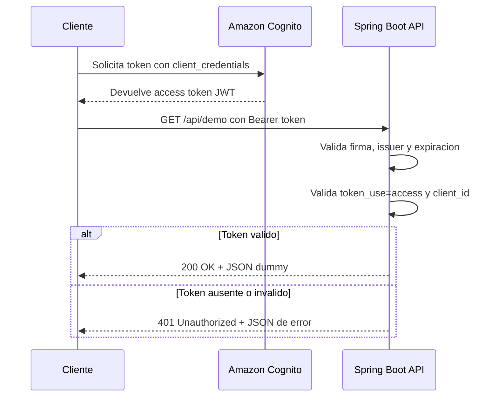

# cloud-01-backend

API Spring Boot minima, lista para validar tokens JWT emitidos por Amazon Cognito.

## Ejecutar en modo local

El perfil `cognito` es el predeterminado. Para ejecutar sin autenticacion durante el desarrollo, activa explicitamente el perfil `local`:

```powershell
mvn spring-boot:run "-Dspring-boot.run.profiles=local"
```

Prueba el endpoint en `http://localhost:8080/api/demo`.

```json
{
  "message": "API Spring Boot operativa",
  "status": "ok"
}
```

## Activar Amazon Cognito

Completa el archivo `.env` con el emisor de tu User Pool y el App client que usara el flujo `client_credentials`:

```properties
COGNITO_ISSUER_URI=https://cognito-idp.<region>.amazonaws.com/<user-pool-id>
COGNITO_CLIENT_ID=<app-client-id>
```

Luego inicia la aplicacion sin cargar variables manualmente en la terminal:

```powershell
mvn spring-boot:run
```

Con ese perfil, `/api/demo` exige un access token JWT valido emitido por Cognito. El token debe incluir `token_use=access` y un `client_id` igual a `COGNITO_CLIENT_ID`:

```http
Authorization: Bearer <access-token-de-cognito>
```

Spring Security obtiene las claves publicas del User Pool desde el `issuer-uri` y valida la firma y las fechas del token.

Una solicitud sin token, con un token expirado o con otro `client_id` responde `401 Unauthorized`.

## Flujo de la aplicacion

1. Al ejecutar `mvn spring-boot:run`, Spring Boot carga las propiedades desde `.env` mediante `application.yml`.
2. El perfil predeterminado es `cognito`, por lo que la API inicia protegida. El perfil `local` debe activarse explicitamente y permite probar el endpoint sin autenticacion.
3. El cliente solicita un access token a Cognito usando el flujo `client_credentials`, su `client_id` y su secreto.
4. El cliente envia el token a la API mediante el encabezado `Authorization`:

  ```http
  Authorization: Bearer <access-token-de-cognito>
  ```

5. Spring Security valida la firma, el emisor (`issuer`), la vigencia del JWT y los claims requeridos:
  - `token_use` debe ser `access`.
  - `client_id` debe coincidir con `COGNITO_CLIENT_ID`.
6. Si el token es valido, la solicitud llega a `GET /api/demo` y la API responde `200 OK` con el JSON dummy.
7. Si el token falta o no es valido, la solicitud se rechaza antes de llegar al controlador con `401 Unauthorized` y un mensaje JSON.



El `client_secret` se utiliza para obtener el token en Cognito. La API no lo necesita para validar el JWT y debe mantenerse fuera del codigo y del repositorio.